<div align="center">



**AI-powered developer career OS. Know where you stand. Then fix it.**

[](https://roastfolio.karanbuilds.dev)
[](https://github.com/Karan-g-2003/RoastFolio)
[](LICENSE)

</div>

---

## `> SYSTEM_OVERVIEW`

RoastFolio is a full-stack AI platform that analyzes developer portfolios, GitHub profiles, and resumes — then delivers brutally honest, scored feedback across 6 dimensions. Built with a cyberpunk terminal aesthetic and powered by Groq's free AI inference.

**The character arc:** You arrive as *The Ghost Dev* with an F grade. You leave as *The Real Deal* with an A.

---

## `> CORE_FEATURES`

### 🔥 ROAST_PROTOCOL
- Paste any URL — portfolio, GitHub profile, GitHub repo, or deployed project
- Upload your resume PDF (or both URL + PDF for deepest analysis)
- AI detects input type automatically and adjusts analysis strategy
- 4 roast modes: **Unhinged** / **Brutal** / **Honest** / **Soft**
- Scored across 6 dimensions with specific, actionable verdicts

### 📊 6 ANALYSIS DIMENSIONS
| Dimension | What it measures |
|---|---|
| `PROJECT_QUALITY` | Real projects vs tutorial clones |
| `DESCRIPTION_CLARITY` | 10-second recruiter test |
| `TECH_STACK_DEPTH` | Junior tools vs production-grade tech |
| `GITHUB_HEALTH` | Activity, stars, README quality |
| `PRESENTATION` | Live demos, design, professional appearance |
| `RECRUITER_APPEAL` | 6-second resume scan test |

### 🎯 7 DEVELOPER ARCHETYPES
```
The Tutorial Collector  →  The Ghost Dev  →  The Overclaimer
The Hidden Gem          →  The Almost There               
The Real Deal           →  The Blank Slate
```

### ⚡ SMART INPUT DETECTION
RoastFolio automatically detects what you submit and changes its analysis strategy:
- `github.com/username` → GitHub profile analysis
- `github.com/username/repo` → Single project deep-dive  
- `yourname.vercel.app` → Live app evaluation
- `yourportfolio.com` → Full portfolio roast
- Resume PDF only → Resume-as-document analysis
- URL + PDF → Cross-referenced combined analysis

---

## `> TECH_STACK`

```
FRONTEND                    BACKEND                     AI + SERVICES
────────────────────        ────────────────────        ────────────────────
React 18 + Vite             Node.js + Express           Groq API (free)
Tailwind CSS                Multer (PDF upload)         Llama 3.3 70B / Qwen3
Clerk (auth)                Cheerio (scraping)          Jina AI (JS rendering)
React Query                 Supabase (PostgreSQL)       GitHub REST API
Zustand (state)             Express Rate Limiter        
React Dropzone              Clerk SDK (JWT verify)      

DEPLOYMENT
────────────────────
Frontend → Vercel
Backend  → Vercel Serverless
Database → Supabase (Mumbai region)
Domain   → karanbuilds.dev
```

---

## `> QUICK_START`

### Prerequisites
- Node.js 18+
- Git

### Installation

```bash
# Clone the repo
git clone https://github.com/Karan-g-2003/RoastFolio.git
cd RoastFolio

# Install backend dependencies
cd backend && npm install

# Install frontend dependencies  
cd ../frontend && npm install
```

### Environment Setup

**Backend** — create `backend/.env`:
```env
PORT=3001
GROQ_API_KEY=your_groq_key          # console.groq.com (free)
CLERK_SECRET_KEY=your_clerk_secret  # clerk.com (free)
CLERK_PUBLISHABLE_KEY=your_clerk_pk
SUPABASE_URL=your_supabase_url      # supabase.com (free)
SUPABASE_SERVICE_KEY=your_supabase_service_key
FRONTEND_URL=http://localhost:5173
```

**Frontend** — create `frontend/.env`:
```env
VITE_CLERK_PUBLISHABLE_KEY=your_clerk_pk
VITE_API_URL=http://localhost:3001
VITE_SUPABASE_URL=your_supabase_url
VITE_SUPABASE_ANON_KEY=your_supabase_anon_key
```

### Run Locally

```bash
# Terminal 1 — Backend
cd backend && npm run dev
# → http://localhost:3001

# Terminal 2 — Frontend
cd frontend && npm run dev  
# → http://localhost:5173
```

### Database Setup

Run this SQL in your Supabase SQL editor:

```sql
create table users (
  id text primary key,
  email text,
  name text,
  created_at timestamptz default now()
);

create table roasts (
  id uuid primary key default gen_random_uuid(),
  user_id text references users(id),
  portfolio_url text,
  mode text,
  overall_score integer,
  overall_grade text,
  archetype text,
  full_result jsonb,
  is_public boolean default false,
  created_at timestamptz default now()
);

create table job_matches (
  id uuid primary key default gen_random_uuid(),
  roast_id uuid references roasts(id),
  job_title text,
  company text,
  fit_score integer,
  job_url text,
  created_at timestamptz default now()
);
```

---

## `> API_REFERENCE`

```
POST /api/roast              Submit URL and/or resume for roasting
GET  /api/roast/:id          Fetch a saved roast by ID
PATCH /api/roast/:id/share   Make a roast public (for sharing)
GET  /api/user/history       Get roast history (requires auth)
GET  /api/health             Health check
```

---

## `> COST_TO_RUN`

| Service | Free Tier | Limit |
|---|---|---|
| Groq AI | Forever free | 14,400 req/day |
| Supabase | Forever free | 500MB storage |
| Vercel | Forever free | 100GB bandwidth |
| GitHub API | Forever free | 60 req/hour |
| Jina AI | Forever free | Reasonable usage |
| **Total** | **$0/month** | **~600 roasts/day** |

---

## `> ROADMAP`

- [x] AI roast engine with 4 modes
- [x] PDF resume upload
- [x] GitHub API integration
- [x] Smart input type detection
- [x] Cyberpunk UI with star field
- [x] Custom domain deployment
- [ ] LaTeX resume builder (ATS-optimised)
- [ ] Live job matching via Remotive API
- [ ] AI cover letter generator
- [ ] Progress tracker (re-roast and track improvement)
- [ ] Stripe monetisation ($9/month Pro)

---

## `> PROJECT_STRUCTURE`

```
RoastFolio/
├── backend/
│   └── src/
│       ├── api/index.js          ← Vercel serverless entry
│       ├── routes/               ← Express route handlers
│       ├── services/
│       │   ├── roastEngine.js    ← AI prompt engine (core)
│       │   ├── scraperService.js ← Jina AI + Cheerio scraper
│       │   ├── roastService.js   ← Pipeline orchestrator
│       │   ├── supabaseService.js← Database operations
│       │   └── inputDetector.js  ← Input type detection
│       └── middleware/           ← Auth, rate limit, errors
└── frontend/
    └── src/
        ├── pages/                ← Landing, Roast, Result, Dashboard
        ├── components/           ← UI components + star field
        ├── store/                ← Zustand state
        └── lib/api.js            ← Backend API client
```

---

## `> BUILT_BY`

Built by **Karan** — final year CS student at VIT Chennai.

[](https://github.com/Karan-g-2003)
[](https://linkedin.com/in/karan-g-2003)
[](https://roastfolio.karanbuilds.dev)

---

<div align="center">

```
> SYSTEM_STATUS: ONLINE
> BRUTAL_HONESTY_PROTOCOL: ACTIVE  
> SUGARCOATING: DISABLED
```

**Star this repo if RoastFolio roasted you** ⭐

</div>